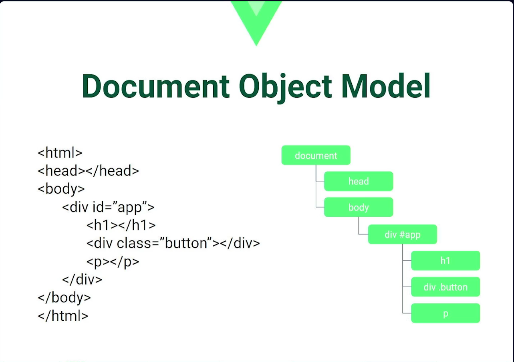
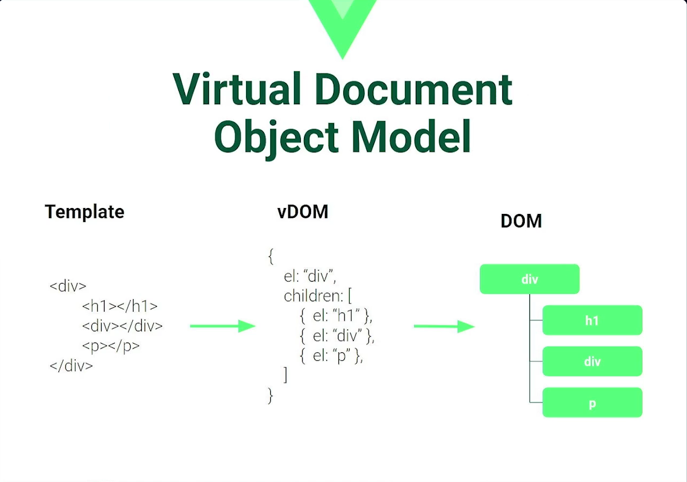
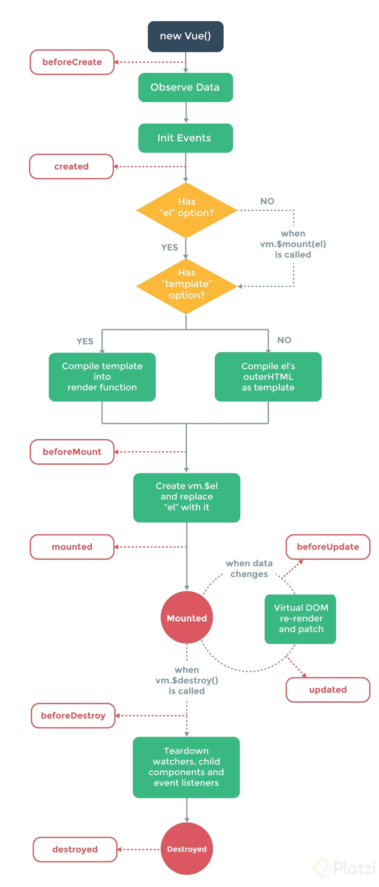

# Curso de Vue.js: Componentes y Composition API

## Índice
* [Clase 02 - Introducción a Vue CLI](#id2)
* [Clase 03 - Estructura del proyecto](#id3)
* [Clase 04 - Componentes dinámicos](#id4)
* [Clase 05 - Componentes asíncronos](#id5)
* [Clase 06 - Transiciones](#id6)
* [Clase 07 - Teleports](#id7)
* [Clase 08 - Virtual DOM](#id8)
* [Clase 09 - Entendiendo el ciclo de vida de los componentes](#id9)
* [Clase 10 - Explorando los primeros hooks del ciclo de vida de Vue](#id10)

---

## Introducción a Vue CLI [2/23]<a name="id2"></a>
La CLI de Vue.js es una herramienta poderosa que facilita la gestión de proyectos. Para instalarla, se pueden seguir los pasos de la [documentación oficial](https://cli.vuejs.org/guide/installation.html).
Los pasos para realizar la instalación son:
Abrir la consola desde Visual Studio Code y escribir el comando:
````
# Instalación usando NPM
npm install -g @vue/cli

# Instalación usando Yarn
yarn global add @vue/cli
````
Una vez terminada la instalación, se pueden verificar las opciones disponibles usando el comando:
````
vue --help
````
Para saber la version de Vue que se instalo, se utiliza el comando:
````
vue --version
````

> [!NOTE]
> El profesor tiene instalada la version: 4.5.15
> En mi equipo quedo instalada la version: 5.0.8

### ¿Cómo crear un nuevo proyecto con Vue.js?
Utilizar el framework implica poder gestionar archivos .vue, estructuras de carpetas y un servidor basado en Webpack. 
Desde la consola, para crear un proyecto, se debe utilizar el siguiente comando:
````
vue create nombre-del-proyecto
````
En este curso, el nombre del proyecto sera **options**.

Luego, la CLI ofrecerá opciones para configurar el proyecto:

> [!NOTE]
> Esta configuración sera para este proyecto, en los próximos proyectos se utilizaran y agregaran otras opciones.

1. Que version utilizar:
Para este ejercicio se seleccionara "opciones manuales" para configurar todo por nosotros mismos:
````
	Default ([Vue 3] babel, eslint)
	Default ([Vue 2] babel, eslint)
	> Manually select features
````
2. Aparecerá un listado de opciones para agregar y preconfigurar en el proyecto.
Con la tecla **espacio** se puede seleccionar o des-seleccionar cada opción. Se dejan seleccionadas las opciones:
````
    (*) Babel
    (*) Linter/formatter
````
3. Preguntara que version de Vue utilizar, seleccionar:
````
    (*) 3.x
        2.x
````
4. Preguntara que configuración de linter utilizar, seleccionar:
````
    (*) ESLint + Prettier
````
5. Preguntara si cada vez que se guarde un cambio, muestre los errores, seleccionar:
````
    (*) Lint on save
````
6. Preguntara si la configuración de babel, eslint, etc. Se realicen en sus propios archivos de configuración o todo dentro del package.json, seleccionar:
````
    (*) In dedicated config
````
7. Finalmente, preguntara si se quiere guardar esta misma configuración para futuros proyectos (s/N), para este caso sera NO ya que realizaremos nuevas configuraciones en futuros proyectos:
````
    > N
````

Si todos los pasos se siguieron correctamente, se creara la carpeta **options** y dentro, una serie de archivos y carpetas con la configuración básica.
Lo primero que se debe hacer, dentro de la consola, moverse a la carpeta del proyecto:
````
	cd options
````

### ¿Cómo funcionan los scripts preconfigurados?
Al crear el proyecto, dentro del archivo **package.json** se generarán diversos scripts que facilitan manejar tareas comunes:

+ **serve**: Permite ejecutar un servidor local en modo de desarrollo.
````
npm run serve
````
+ **build**: Compila y optimiza tu aplicación para producción.
````
npm run build
````
+ **lint**: Revisa y corrige errores de sintaxis automáticamente.
````
npm run lint
````

### ¿Cómo usar Vue UI para gestionar tus proyectos?
Vue CLI ofrece una interfaz gráfica que se abre dentro de una pestaña del navegador llamada **Vue UI** que permite gestionar proyectos de manera visual.
Para levantar la UI, en la consola escribir el comando:
````
vue ui
````
Esta herramienta te permite:
* Crear e importar proyectos.
* Añadir plugins y dependencias.
* Configurar opciones de linting y estilizado.
* Ejecutar y gestionar comandos de forma intuitiva.

---

### Actualización de como usar Vue 3 en 2024
Desde 2024, la [documentación oficial](https://vuejs.org/guide/quick-start) de Vue recomienda crear nuevos proyectos siguiendo los siguientes pasos:

> [!IMPORTANT]
> Al ejecutar el comando create vue@latest, en la consola preguntara si queremos utilizar la version 3.15.1.
> Solo se puede responder "y", cualquier otra letra cancelara la operación.

1. Ejecutar el comando:
````
npm create vue@latest
````
2. Preguntara el nombre del proyecto, para este ejemplo sera:
````
optionsLatest
````
3. Preguntara el nombre del package, por defecto mostrara el nombre del proyecto:
````
optionsLatest
````
4. Preguntara si queremos incluir alguna de las siguientes características al proyecto, se utiliza la tecla espacio para seleccionar, para este ejemplo repetiremos las elecciones del proyecto **options**:
````
[ ] Typescript
[ ] JSX support
[ ] Router
[ ] Pinia
[ ] Vitest
[ ] End to end testing
[*] Eslint
[*] Prettier
````
5. Preguntara si queremos instalar Oxlint, para este ejemplo sera:
````
No
````
6. Con los pasos anteriores, ya queda configurado el proyecto. A continuación, desde la consola se debe entrar a la carpeta del proyecto:
````
cd optionsLatest
````
7. Luego se deben instalar los paquetes necesarios, con el comando:
````
npm install
````
8. Una vez que terminen de instalar las dependencias, se puede levantar el proyecto y probar si esta todo funcionando correctamente con el comando:
````
npm run dev
````

---

## Estructura del proyecto [3/23]<a name="id3"></a>
La organización de archivos en un proyecto de Vue es esencial para mantener un flujo de trabajo efectivo y ordenado.
Con un conocimiento sólido de las carpetas y archivos clave, se puede desarrollar aplicaciones más organizadas y escalables.

### ¿Qué contiene el archivo package.json?
Es el corazón de cualquier proyecto basado en **Node.js** que usa **NPM** para la gestión de dependencias. Este archivo:
* Define los scripts importantes, como la ejecución del servidor de desarrollo y la compilación para producción.
* Almacena el historial de dependencias del proyecto que se pueden adicionar conforme se avanza en el desarrollo.
* Incluye log.json, que documenta las versiones y dependencias específicas utilizadas.

### ¿Cuál es la función del archivo README?
Sirve como una guía rápida, proporcionando:
* Instrucciones para instalar dependencias.
* Comandos para ejecutar el servidor de desarrollo y compilar para producción.
* Enlaces a la documentación oficial, facilitando la comprensión de la herramienta de terminal de comandos Vue.

### ¿Qué papel juega Babel en el proyecto?
Babel es un transpilador esencial para convertir el código ECMAScript más reciente a una versión compatible con navegadores más antiguos. Este archivo :
* Se incluye un preset básico que facilita su uso sin configuraciones complejas.
* Se asegura de que se puede escribir JavaScript moderno, maximizando las mejores prácticas y características.

### ¿Para qué sirve el archivo .gitignore?
Este archivo es crucial para el control de versiones. Este archivo:
* Ignora archivos y directorios que no se desean registrar en el control de versiones, como *node_modules* o los generados durante la compilación.
* Asegura que solo los archivos necesarios se versionan, manteniendo repositorios limpios.

### ¿Qué configuraciones extra incluye un proyecto Vue por defecto?
Al crear un proyecto Vue con la CLI, se obtienen configuraciones preestablecidas, incluyendo:
* **eslint** con configuraciones básicas recomendadas.
* Integración con **Prettier** para mantener un formato de código coherente.
* Reglas específicas para evitar el uso de console.log en producción, promoviendo un código limpio.

### ¿Dónde se encuentran las dependencias instaladas?
Dentro de node_modules residen todas las dependencias instaladas. Consideraciones claves:
* Este directorio no se debería subir al control de versiones, ya que se puede reconstruir con el comando **npm install**.
* Facilita la gestión y actualización de bibliotecas externas.

### ¿Qué hay dentro de la carpeta public?
La carpeta public actúa como el servidor de archivos estáticos. Dentro se encuentra:
* Un archivo **index.html** que en un principio sera una plantilla inicial, no será el archivo final en producción.
* Archivos que están accesibles como recursos estáticos desde el navegador.

### ¿Cómo se organiza la carpeta src?
La carpeta src es el núcleo del desarrollo frontend. Dentro se encuentra:
+ El archivo **main.js** es el punto de entrada, inicializando la aplicación Vue.
+ **App.vue** actúa como el componente raíz, donde se ensambla el resto de los componentes.
+ **components/** guarda los componentes Vue, organizable en subcarpetas si así se necesita.
+ **assets/** contiene archivos estáticos empaquetados junto con el código de la aplicación, tales como imágenes y css.

### ¿Qué diferencia hay entre las carpetas assets y public?
Aunque ambas carpetas contienen archivos estáticos, sus funciones son diferentes:
* assets: Se empaquetan con el proyecto, accesibles desde el lado del cliente.
* public: Contiene archivos que sirven el contenido estático del servidor, no integrados en el paquete final del JavaScript.

### ¿Cómo puedo personalizar mi estructura de proyecto?
La flexibilidad de los proyectos Vue:
* Permite la creación de subcarpetas dentro de assets y components para mejorar la organización.
* Posibilita ajustes en configuraciones y estructuras según las necesidades específicas del proyecto.
* Incentiva un diseño modular que facilita el mantenimiento y ampliación futura de tu código.

---

## Componentes dinámicos [4/23]<a name="id4"></a>
En el desarrollo web moderno, Vue.js se ha destacado como una herramienta poderosa gracias a su enfoque en la creación de interfaces de usuario mediante la utilización de componentes. La estructura básica de un proyecto en Vue.js aprovecha la sintaxis de ECMAScript, proporcionando una base sólida para el desarrollo.

### ¿Qué es un componente en Vue.js?
Un componente es una parte reutilizable de la interfaz que encapsula HTML, JavaScript y CSS. Estos componentes son esenciales para crear aplicaciones modulares y escalables. Por ejemplo, en un archivo **.vue** se estructura de la siguiente manera:
+ **Template**: Define la estructura HTML.
+ **Script**: Incluye el JavaScript que controla la lógica del componente.
+ **Style**: Permite estilizar el componente.

La ventaja principal de utilizar componentes es que permiten tener una estructura más organizada, integrando cada pieza de la interfaz con sus funcionalidades y estilos en un único archivo.

### ¿Cómo se registran los componentes?
Para utilizar un componente dentro de un proyecto Vue.js, es fundamental registrarlo en la instancia de Vue:
````javascript
import HelloWorld from './components/HelloWorld.vue'; // Importar el componente

export default {
  components: {
    HelloWorld // Registrar el componente
  }
};
````
En este ejemplo, el componente **HelloWorld** se importa desde la carpeta de **components** y se registra en el objeto components de Vue. Esto habilita su uso dentro de la parte de Template, permitiendo que se incluya fácilmente en la interfaz de usuario.

### ¿Qué son los componentes dinámicos?
Los componentes dinámicos son una característica avanzada de Vue.js que permite cambiar un componente en tiempo real basado en estados o propiedades. Esto es especialmente útil para aplicaciones interactivas que dependen de datos externos como respuestas del servidor o entradas del usuario.

### ¿Cómo funcionan los componentes dinámicos?
Para implementar componentes dinámicos, Vue.js utiliza el componente < component >, que emplea un atributo especial llamado **:is**. Este atributo define qué componente se debe renderizar:
````html
<component :is="nombreComponente"></component>
````
La variable *nombreComponente* puede ser un nombre de componente almacenado en el estado de la aplicación, que puede cambiar según las interacciones del usuario o eventos del sistema.

### ¿Cómo se implementan los componentes dinámicos?
Utilizamos como base el código por defecto y se agrega la propiedad data() y dentro se define qué componente se debe mostrar:
````javascript
data() {
  return {
    componenteActual: 'HelloWorld'
  };
}
````
Y dentro del template se utiliza la siguiente estructura para un componente dinámico:
````
<template>
  <component :is="componenteActual"></component>
</template>
````
El componente por defecto, *HelloWorld*, se renderizará solo si se define y se registra adecuadamente en el componente padre. 
Los beneficios de utilizar esta forma de renderizado son significativos: se puede modificar de manera reactiva qué partes de tu aplicación se muestran sin afectar la estructura que ya existe o los elementos cercanos.

### ¿Cómo se aplica el scope en los estilos?
Dentro de los estilos de un Single File Component (SFC), los estilos aplicados son globales a menos que se especifique lo contrario. Para aislar los estilos de un componente y evitar que afecten al resto de la aplicación, Vue.js permite el uso del atributo scoped:
````css
<style scoped>
  /* Estilos limitados a este componente */
  .mi-clase {
    color: blue;
  }
</style>
````
Esto asegura que los estilos aplicados a los elementos del template de un componente no se propaguen a otros componentes, manteniendo la encapsulación y el control de diseño necesario en proyectos más grandes.

---

### Corregir errores que pueden aparecer en Visual Studio Code.

#### Primer problema
Si al abrir un archivos como *vue.config.js* o *babel.config.js* aparece el siguiente error **Parsing error: No Babel config file detected.**
En el menu de Visual Studio Code, ir al menu: archivo --> preferencias -->  configuración
En la barra de búsqueda que aparecerá, escribir **eslint**.
La ventana cambiara su contenido, se debe bajar hasta encontrar un enlace en azul que dice editar en settings.json
Se abrirá una nueva ventana donde se debe agregar el siguiente código:
````
"eslint.workingDirectories": [
        {"mode": "auto"}
 ],
````
Se guardan los cambios y con eso debería desaparecer el mensaje de error.

#### Segundo problema
Si al abrir un archivo *.vue* aparece el siguiente error: **[vue/no-multiple-template-root] The template root requires exactly one element.**
Se debe a que la extension **Vetur** de Visual Studio Code no es capaz de encontrar el archivo de configuración, los que tienen config en su nombre.
Para solucionarlo, solo se debe abrir el proyecto solo en VSC.
Desde la consola, posicionarse en la carpeta del proyecto y escribir el comando:
````
code .
````

---

## Componentes asíncronos [5/23]<a name="id5"></a>
Los componentes asíncronos en Vue.js son una formidable herramienta que mejora de gran manera el rendimiento y la experiencia de usuario de nuestras aplicaciones. En esencia, permiten cargar componentes solo cuando son necesarios, evitando así la carga inicial de elementos que el usuario podría no utilizar de inmediato. Esto no solo optimiza el tiempo de carga de las aplicaciones, sino también el uso de los recursos del navegador, haciendo que las aplicaciones sean más livianas y ágiles.

### ¿Cómo configurar los DevTools de Vue.js?
El primer paso sera buscar la herramienta Vue DevTools. La instalación es sencilla:
1. Accede a la Chrome Store (o Firefox Add-ons si usas Firefox).
2. Buscar **Vue.js DevTools**.
3. Instala la versión en el navegador.

Luego de la instalación, cerrar y reabrir la pestaña del navegador para que las DevTools de Vue.js funcionen correctamente.

### ¿Cómo implementar un componente asíncrono en Vue.js?
Para crear un componente asíncrono, se utiliza la función **defineAsyncComponent** proporcionada por la biblioteca de Vue.js. Este es un procedimiento simple que se lleva a cabo mediante estos pasos:

1. Importar la función defineAsyncComponent:
````javascript
import { defineAsyncComponent } from "vue";
````
2. Definir el componente de manera asíncrona: Se declara una variable para el componente y se define el uso de defineAsyncComponent mediante una función flecha para importar el componente deseado.
````javascript
const HelloWorld = defineAsyncComponent(() => import("./components/HelloWorld.vue"));
````
3. Registrar el componente: se declara el nombre de la variable en la sección *components* de tu componente padre para que Vue.js lo reconozca y se pueda utilizar.

Con esta configuración, el componente se cargará solo cuando sea necesario, mejorando así la eficiencia de tu aplicación.

> [!IMPORTANT]
> El profesor crea el código para importar el componente en una sola linea, pero la dependencia **eslint** lo marca como error ya que debe hacerse respetando una separación de enter y espacios. Leer la ayuda que entrega VSC para corregirlo.

````javascript
const HelloWorld = defineAsyncComponent(() =>
  import("./components/HelloWorld.vue")
);
````

### ¿Qué ventajas ofrece el uso de componentes asíncronos?
Ofrece varias ventajas importantes como:
* Rendimiento mejorado: Al cargar únicamente los componentes necesarios, se reduce en gran parte el tiempo de carga inicial de la aplicación.
* Código más limpio y organizado: Separar los componentes en distintos archivos permite mantener un código más estructurado y fácil de mantener.
* Optimización del uso de recursos: Mejora el uso de recursos tanto del cliente como del servidor, al no requerir la carga completa de todos los componentes desde el inicio.

### ¿Qué sucede al compilar una aplicación Vue.js?
Cuando se compila una aplicación se genera una carpeta **dist** que contiene todos los archivos necesarios para ejecutar la aplicación en un entorno de producción. Este proceso elimina la carpeta anterior y crea una nueva con los siguientes elementos:
* Archivos CSS y JavaScript minificados: Estos archivos son utilizados para asegurar que la aplicación sea ligera y rápida de cargar.
* Archivos estáticos: Imágenes y otros recursos que la aplicación utiliza.
* Código JavaScript compilado: El archivo principal de JavaScript que incluye la lógica de la aplicación.
* Versionado de archivos: Cada archivo recibe un identificador único (id) para facilitar el manejo de versiones y evitar confusiones con versiones anteriores.

---

## Transiciones [6/23]<a name="id6"></a>
Uno de los componentes más importantes dentro de Vue.js es el componente **Transition**. Este permite aplicar estilos CSS a elementos que aparecen o desaparecen en pantalla, como por ejemplo un menú desplegable.

### ¿Cómo se configura un proyecto?
El proyecto sera un menú que se muestra y oculta. Esto se logra mediante la manipulación de una variable booleana que controlará la visibilidad del menú, por lo que el primer paso sera crear dicha variable con un valor false por defecto:
````javascript
data() {
  return {
    show: false
  };
},
````

### ¿Cómo crear un menú desplegable?
Para el menú, se crea un nuevo componente que muestra opciones en una lista:
````html
<!-- Componente Menu.vue -->
<template>
  <ul v-if="show">
    <li>Opción uno</li>
    <li>Opción dos</li>
    <li>Opción tres</li>
  </ul>
</template>
````

### ¿Cómo implementar un básico V-IF y V-SHOW?
Se utiliza la directiva **v-if** para mostrar u ocultar el menú basándose en la variable show.
Sin embargo, la directiva ** v-show** puede ser una alternativa para solo aplicar un CSS de *display: none* en vez de montar o desmontar el elemento del DOM, mejorando así el rendimiento de la aplicación.

### ¿Qué es un componente Transition?
El componente **transition** se utiliza para envolver un único elemento y permitir la aplicación de **efectos de entrada y salida**. Para configurar, se necesitar definir el nombre de la transición, que será utilizada para nombrar las clases CSS asociadas:
````javascript
<transition name="fade">
  <menu v-if="show"></menu>
</transition>
````

### ¿Qué clases CSS son necesarias para la transición?
Al predefinir un nombre para la transición, se pueden crear clases CSS específicas que manejan los tres estados de una transición: inicio, activo y final. Estos se denominan:
* from (inicio)
* active (activo)
* to (final)
````css
.fade-enter-active, .fade-leave-active {
  transition: opacity 0.5s ease;
}
.fade-enter-from, .fade-leave-to {
  opacity: 0;
}
````

### ¿Cómo aplicar animaciones como fade in y fade out?
Para lograr un efecto visual suave al mostrar o ocultar el menú, se puede modificar la opacidad del elemento. Se utilizan propiedades de CSS como *transition* y *opacity* para lograr un desvanecimiento.
+ **opacity: 0;** al comenzar a ocultar el elemento
+ **opacity: 1;** cuando el elemento es completamente visible

---

## Teleports [7/23]<a name="id7"></a>
Los **teleports**, anteriormente conocidos como **portals** en Vue.js 2, son una característica de Vue que permite mover un componente a una ubicación diferente dentro del DOM, sin cambiar la forma en que esta organizado el código. 
Esto es sumamente útil, por ejemplo, para mostrar un modal que debería aparecer al nivel del *body* sino en un componente interno.

### ¿Cómo crear un modal con teleports?
Se crea un componente nuevo con el código para un modal básico. Aquí se utilizara la función **teleport** para desplazar el componente al **body** del documento HTML.
````vue
<template>
    <div>
        <button @click="toggle">Abrir Modal</button>
        <teleport to="body">
            <div v-show="show" class="modal">
                <h1>Título del Modal</h1>
                <p>Contenido del modal.</p>
                <button @click="toggle">Cerrar</button>
            </div>
        </teleport>
    </div>
</template>

<script>
export default {
  data() {
    return {
      show: false
    }
  },
  methods: {
    toggle() {
      this.show = !this.show;
    }
  }
}
</script>

<style scoped>
.modal {
  /* Aquí puedes agregar estilos para el modal */
}
</style>
````

Este código establece que el nuevo componente utilizara la directica **v-show** para controlar la visibilidad del modal, la variable **show** con un valor *false* por defecto y la función **toggle()** para cambiar el valor de la variable y si se mostrara o no el modal.

### ¿Cómo funcionan los teleports en Vue.js?
Cuando se desea que una parte del componente se muestre en una ubicación diferente, simplemente se debe encapsular esa parte de codigo dentro del elemento < teleport > y luego definir su nuevo destino utilizando el atributo **to**.

### Ejemplo de uso de teleports
En el código del ejemplo anterior, el componente *modal* está envuelto dentro de la etiqueta < teleport to="body" >, lo que permite que el contenido se inserte al final del < body > del documento.
Al abrir el inspector de elementos, se vera de la siguiente manera:
````javascript
<body>
  ...
  <teleport start></teleport>
  <div class="modal" style="display: none;">
    <h1>Título del Modal</h1>
    <p>Contenido del modal.</p>
    <button>Cerrar</button>
  </div>
  <teleport end></teleport>
</body>
````
Esta estructura muestra claramente cómo los elementos se han movido dentro del < body >, manteniendo una organización lógica dentro del archivo Vue específico.

### ¿Cuáles son las ventajas y recomendaciones de los teleports?
El uso de teleports ayuda a mantener una mejor organización y reutilización del código.  Algunos beneficios y recomendaciones:

1. **Modularidad**: Mantener el código fragmentado y modular. De esta forma se puede definir componentes complejos que se pueden plasmar en diferentes partes del DOM sin desorganizar el código fuente original.
2. **Reutilización**: Un archivo Vue puede exportarse y utilizarse en diferentes proyectos, utilizando siempre el mismo esquema, pero mostrando el componente donde más se adapte visualmente.
3. **Flexibilidad de diseño**: Permite ajustar la disposición del contenido en el DOM, mejorando la presentación de algunos elementos como modales, tooltips, entre otros.
4. **Separación de Concerns**: Al separar la lógica de visualización de la lógica de estructura en la aplicación, es más fácil manejar estilos, scripts y demás cuestiones relacionadas con la presentación.

---

## Virtual DOM [8/23]<a name="id8"></a>
El Virtual DOM es un concepto clave detrás de muchos frameworks modernos como Vue.js y React.js que optimiza la manipulación de interfaces de usuario complejas. Proporciona una representación intermedia del DOM real, que es más rápida y eficiente de modificar en memoria antes de aplicar los cambios al DOM tangible del navegador.

### Primero, ¿Qué es el DOM?
El DOM o Document Object Model es la estructura base de un proyecto web. Se representan todos los objetos HTML como si se tratara de un árbol de elementos, donde el **DOCUMENT** es la raíz, luego viene el header, el body, etc.… Y todo esto se va acomodando en forma de árbol.



### ¿Que es el virtual DOM?
Vue utiliza una capa intermedia hecha en JavaScript con el motivo de que cada vez que se realicen accesos al DOM de forma manual, por ejemplo: utilizando *create element* o *getElementById* y otras formas que nos da JavaScript de acceder al DOM para controlarlo, agregar y quitar elementos.
Luego se obtiene **representación** que es una copia del DOM, pero es un DOM virtual, es decir, es un objeto de JavaScript que esta viviendo en la memoria RAM y por lo tanto es mucho más fácil acceder y modificar como cualquier otro objeto en JS.



### ¿Cómo funciona el Virtual DOM?
1. **Intermediario en JavaScript**: El Virtual DOM actúa como una capa intermedia que representa el DOM real de manera virtual en JavaScript.
2. **Modificaciones ágil**: Las actualizaciones se realizan primero en el Virtual DOM, lo cual es más rápido y requiere menos líneas de código que manipular directamente el DOM tradicional.
3. **Aplicación en bloque de cambios**: Una vez que se han realizado todas las actualizaciones necesarias, el framework aplica de forma eficiente todos los cambios al DOM real de una sola vez, mejorando el rendimiento.

### ¿Por qué no modificar directamente el DOM?
Acceder y manipular el DOM real puede ser costoso en términos de rendimientos. Cada interacción implica una re-renderización que consume memoria y tiempo de procesamiento. En cambio, al modificar el Virtual DOM primero, se limita el número de interacciones con el DOM real, lo que mejora la eficiencia y la rapidez.

### ¿Cómo afecta el Virtual DOM al desarrollo de componentes?
El uso del Virtual DOM simplifica la manera en que se manejan los componentes:

+ **Actualización reactiva**: Las librerías pueden detectar cambios en los datos y actualizar la representación visual de forma eficiente.
+ **Manejo de componentes complejos**: Facilita la gestión de componentes anidados, haciendo más sencilla la comunicación y el intercambio de datos entre ellos.
+ **Optimización de rendimiento**: Permite realizar optimizaciones automáticas para mejorar el rendimiento sin cambiar mucho del código escrito por el desarrollador.

### ¿Cómo se relaciona con el ciclo de vida de los componentes?
El Virtual DOM está vinculado de forma directa con el ciclo de vida de los componentes:

+ **Montaje y actualización**: Durante el ciclo de vida, el Virtual DOM se utiliza para montar los componentes y garantizar que cualquier cambio de estado requerido se vea reflejado en la interfaz de usuario.
+ **Detección de cambios**: Está diseñado para capturar y responder a eventos como prop updates o modificaciones de estado, asegurando que la manipulación del DOM sea lo más eficiente posible.

---

## Entendiendo el ciclo de vida de los componentes [9/23]<a name="id9"></a>
Uno de los conceptos fundamentales que se debe dominar es el ciclo de vida de un componente, que determina su uso desde su creación hasta su eliminación. 
Cada componente pasa por una serie de fases que son gestionadas por un conjunto de funciones conocidas como **hooks** del ciclo de vida. Esto ayuda a administrar cambios en el virtual DOM de manera eficiente y optimizada.

### ¿Cómo se inicializa un componente en Vue.js?
El proceso comienza con la ejecución de las funciones **createApp** y **mount**, que crean la instancia raíz de Vue.js. 
Durante esta etapa, se inicializan todos los eventos y las funciones del ciclo de vida necesario para cada componente. Posteriormente, el componente se inicia en un estado llamado **beforeCreate()**. Aquí, se puede ejecutar código que preparará el terreno antes del inicio del componente, como declaración de variables o carga inicial de inspiraciones.
````vue
beforeCreate() {
    // Código a ejecutar antes de crear el componente.
}
````

### ¿Qué ocurre durante la creación del componente?
Una vez que el componente entra en el estado creado, se ejecuta la función **created()**.
En este momento, la definición completa del componente ya está establecida, aunque todavía no está adjunta al DOM. Es el punto donde se realizan peticiones de datos o preparaciones que no requieren interacción directa con el DOM.
````vue
created() {
    // Código que se ejecuta una vez creado el componente.
    // Ideal para descargar datos o ejecutar sincronizaciones.
}
````

### ¿Cuándo y cómo se monta un componente al DOM?
El siguiente paso dentro del ciclo de vida es el montaje del componente en el DOM.
Antes de este evento, la función **beforeMount()** será ejecutada, permitiendo hacer ajustes finales antes de que el componente esté visible en el documento.
````vue
beforeMount() {
    // Código que se ejecuta antes de montar el componente en el DOM.
}
````
Tras ello, el componente es finalmente montado y la función **mounted()** se dispara, permitiendo realizar actividades que requieren el componente ya esté en el DOM, tales como manipulación de elementos específicos o inicialización de librerías basadas en el DOM.
````vue
mounted() {
    // Código que se ejecuta cuando el componente está montado.
    // Manipulación de elementos DOM.
````

### ¿Qué sucede cuando el componente tiene que actualizarse?
Una vez montado, el componente está en un estado reactivo y cualquier cambio en sus datos puede desencadenar una actualización. 
Antes de este cambio, la función **beforeUpdate()** se ejecuta para permitir ajustes previos a la modificación del DOM.
````vue
beforeUpdate() {
    // Código que se ejecuta antes de actualizar el DOM.
}
````
Tras la actualización, la función **updated()** se ejecuta, donde se puede realizar operaciones post-actualización.
````vue
updated() {
    // Código que se ejecuta después de una actualización del DOM.
}
````

### ¿Cómo es el proceso de desmontaje del componente?
Cuando un componente necesita ser removido, se ejecutan dos funciones importantes: **beforeUnmount()** y **unmounted()**.
En beforeUnmount, tienes la oportunidad de limpiar recursos, cerrar conexiones o eliminar cualquier referencia vinculada al componente antes de que desaparezca completamente.
````vue
beforeUnmount() {
    // Código para la limpieza antes de desmontar el componente.
}
````
Finalmente, unmounted marca el momento en que el componente ya ha sido desligado del DOM y te permite notificar a otros componentes o realizar limpieza adicional.
````vue
unmounted() {
    // Código final después de desmontar el componente
}
````

### Árbol del ciclo de vida
Para comprender mejor el ciclo de vida de los componentes, se puede ver graficado en esta imagen.



> [!IMPORTANT]
> En la documentación de Vue, el ciclo beforeUnmount() puede aparecer como beforeDestroy() y el ciclo unmounted() puede aparecer como destroyed.

1. beforeCreate.
2. created.
3. beforeMount.
4. mounted.
5. beforeUpdate.
6. updated.
7. beforeUnmount (beforeDestroy).
8. unmounted (destroyed).

---

## Explorando los primeros hooks del ciclo de vida de Vue [10/23]<a name="id10"></a>
El ciclo de vida de los componentes en Vue es una herramienta crucial para los desarrolladores, permitiendo gestionar el tiempo de vida de un componente desde su creación hasta su destrucción.

### ¿Qué hooks del ciclo de vida podemos usar?
Vue ofrece varios **hooks** que se pueden utilizar para ejecutar código en diferentes etapas del ciclo de vida de un componente. Algunos de los hooks más comunes son:

+ **beforeCreate**: se ejecuta antes de que el componente sea creado.
+ **created**: se ejecuta después de que el componente ha sido creado.
+ **mounted**: se ejecuta una vez que el componente ha sido insertado en el DOM.
+ **unmounted**: se ejecuta cuando el componente ha sido removido del DOM.

### Ejemplo práctico
A continuación, presentamos un script que implementa algunos de estos hooks dentro de un componente Vue, mostrando cómo y cuándo podemos acceder a diferentes partes del componente:
````vue
export default {
  data() {
    return {
      text: 'Hola, Vue',
    };
  },
  beforeCreate() {
    console.log('beforeCreate: ', this.data, this.$el);
  },
  created() {
    console.log('created: ', this.data, this.text);
  },
  mounted() {
    console.log('mounted: ', this.data, this.$el);
  }
}
````

### ¿Qué sucede con los objetos data y DOM en cada hook?
Al ejecutar el anterior y observar los resultados en la consola del navegador, se puede analizar el comportamiento de los diferentes hooks:

1. beforeCreate:
	* En este punto, el objeto "data" está vacío y el elemento del DOM (this.$el) aún no existe. No se han inicializado las variables reactivas de Vue.
2. created:
	* Aquí, el objeto "data" ya ha sido creado y la variable "text" está disponible.
Sin embargo, el elemento del DOM aún no está disponible, puesto que el componente no ha sido montado.
3. mounted:
	* En este momento, tanto el objeto "data" como el elemento del DOM están presentes. Esto permite interactuar con el DOM utilizando JavaScript puro, pudiendo modificar o acceder al HTML del componente.

---